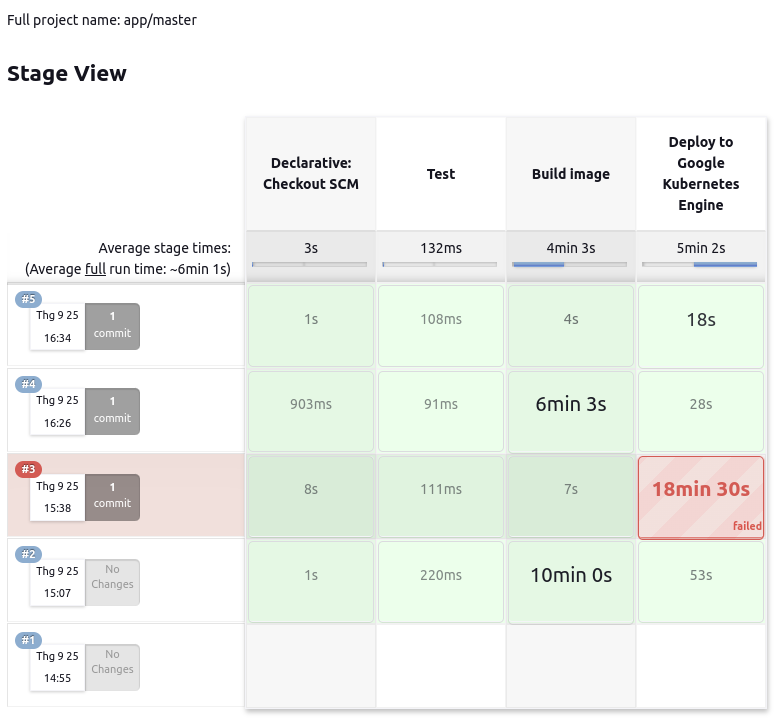

# Deploy [text image retrieval service](https://github.com/duongngyn0510/text-image-retrieval) to Google Kubernetes Engine using CI/CD
## System Architecture


## GKE Cluster
+ Unable Autopilot for the cluster. When using Autopilot cluster, certain features of Standard GKE are not available, ex scraping metrics job of Prometheus service.
+ GKE cluster is deployed at *us-central1-f* with its node machine type is: *n2-standard-2* (2 CPU and 8 GB RAM).

### Serving Service
+ The requests will initially arrive at the Nginx Ingress Gateway and will subsequently be routed to the service within the `model-serving` namespace of the GKE cluster.
+ The deployment is deployed with 2 pod replicas.

### Monitoring Service
Prometheus will scrape metrics from the running application pods and nodes in GKE cluster. Subsequently, Grafana will display information such as CPU and RAM usage for system health monitoring, and system health alerts will be sent to Discord.

+ CPU and RAM usage of 2 pods that running application


+ CPU and RAM usage in Node


## CI/CD using Jenkins

+ Jenkins is deployed on Google Compute Engine with a machine type is *n1-standard-2*.
+ Install **Helm** on Jenkins using the `Dockerfile-jenkins-k8s` to enable application deployment on GKE cluster.
+ The CI/CD pipeline will consist of three stages:
    + Tesing model correctness.
    + Building the image, and pushing the image to Docker Hub.
    + Finally, it will deploy the application with the latest image from DockerHub to GKE cluster.



## Test API
### 1. Update nginx ingress domain
```bash
sudo nano /etc/hosts
```
Add this line to `/etc/hosts`
```bash
34.133.25.217 retrieval.com
```
Run `client.py` to request to serving service in GKE cluster.
+ Image query
```bash
$ python client.py --save_dir temp.html --image_query your_image_file
```
+ Text query
```bash
$ python client.py --save_dir temp.html --text_query your_text_query
```
**Note**: Refresh the html page to display the images.
